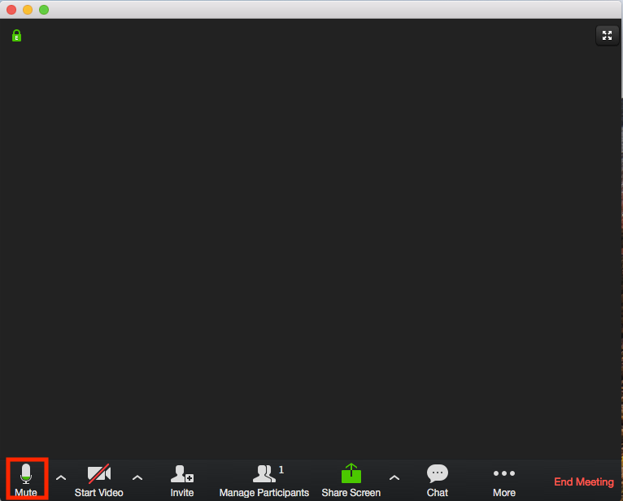
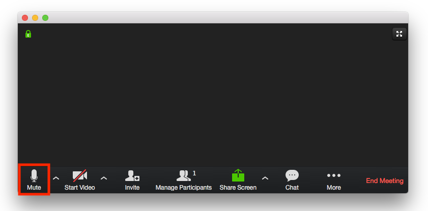
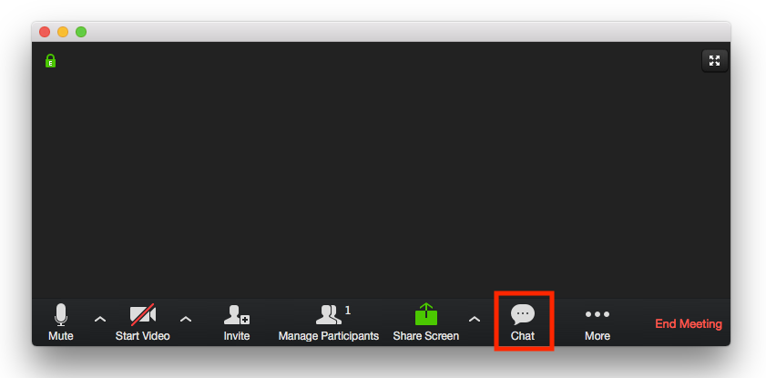

# before we begin...

Please make sure your microphone is muted when not speaking, and use chat to ask questions while someone else is speaking

Other recommendations:
- use gallery view if there are a lot of individual attendees
- right click on a speaker and click "chat" to choose to message them directly

Note:
"Before we begin, please mute your microphone when not talking, and use the group chat to ask any questions." click

---

Note:
"This is what the default zoom page should look like (roughly)" click

---

Note:
"To mute your microphone, click the mute button as shown here outlined with a red box." click

---

Note:
"To open the group chat window, click on the chat button shown here outline with a red box." click
